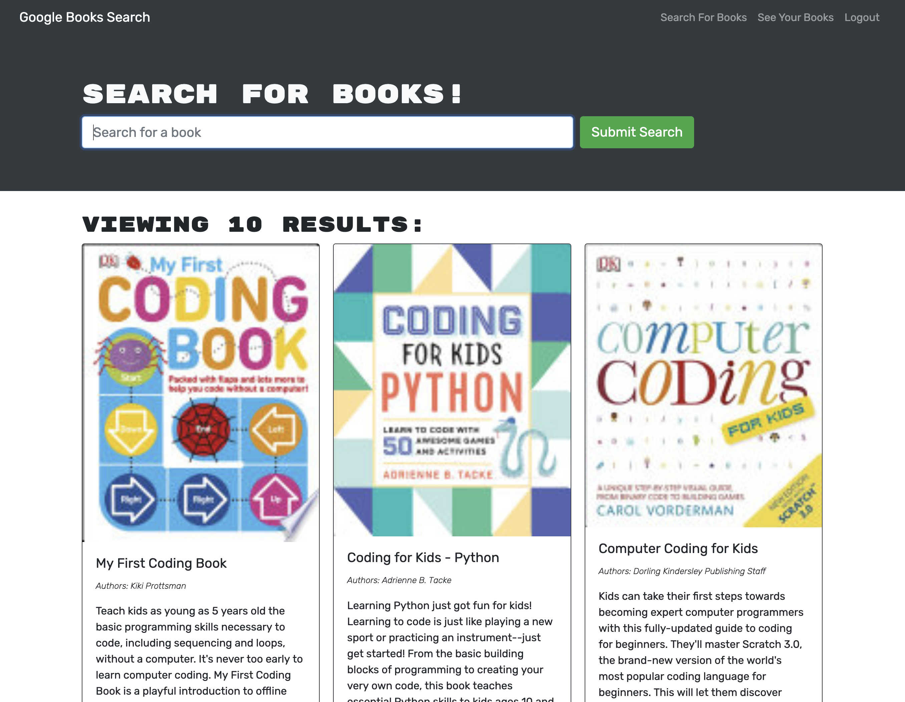

# Novel Hunt

## Table of contents
* [Description](#description)
* [Installation](#installation)
* [Usage](#usage)
* [Technologies](#technologies)
* [References](#references)
* [Process](#process)
* [Results](#results)
* [Credit](#credit)

## Description
Convert a fully functioning Google Book API serach engine built with a RESTful API into a GraphQL API with the Apollo Server.

## Installation
Navigate into the root directory, the client folder, and the server folder, seperately and type in the following to install all appropriate packages and dependencies:
```
npm install
```

## Usage
To run this application, navigate to the root directory and type the following into the command line:

```
npm run develop
``` 

## Technologies
* HTML/CSS
* VS Code
* JavaScript
* Terminal
* Git/GitHub
* NoSQL
* MongoDB
* Mongoose
* MongoDB Atlas
* Express.js
* React
* GraphQL
* Apollo Server
* Apollo Provider
* Heroku

## Process
### STEP 1. - SETUP
* Clone starter code and create GitHub Repository with a unique name
* Push first commit of files into the new Repo using Git
* Installed npm packages in the root, Client, and Server directories

### STEP 2. - UPDATE BACK-END
* Modify auth middleware
* Implement Apollo Server and apply to the Express Server
* Add Schemas directory with index, resolvers, and Type Definition files
* Define Query and Mutation types in Type Definition file

### STEP 3. - UPDATE FRONT-END
* Create Query and Mutation files 
* Create an Apollo Provider
* Update Components and Pages
* Update query to get user data
* Update functions in to save a book and delete a book

### STEP 4. - FINALIZE AND DEPLOY
* Work through various bugs
* Make various commits throughout process to save progress
* Deploy to Heroku
* Make tweaks and finished README.md

## Results
* [Heroku Link](https://obscure-everglades-16244.herokuapp.com/)
* [GitHub Repository](https://github.com/etrenholm/novel-hunt)

### Output Example


## Credit
Erica Trenholm: https://github.com/etrenholm

### ©️ June 2022